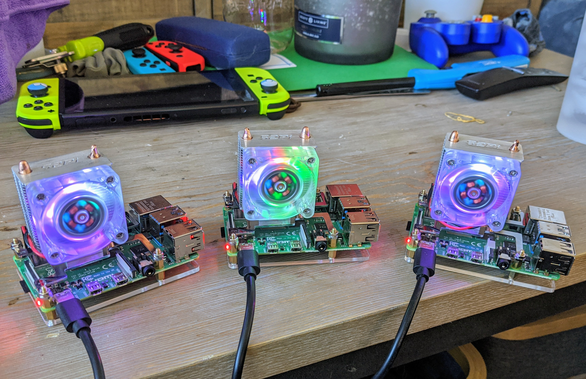

# Homelab

## Parts
1. UniFi Dream Machine Pro
2. 2x UniFi PRO Access Points
3. Antsle one XD:
    - 4 Cores (8 Threads)
    - 32GB DDR4 ECC RAM
    - 2 x 250GB SSD
    - ZFS
4. Monoprice 9U 450mm Depth Server Cabinet
5. QNAP 2 Bay NAS with 4TB Seagate IronWolf Drives
6. NETGEAR Cable Modem CM1000
7. 3x 8GB Raspberry Pi 4

**3/7/20** - Set up disk mirroring (RAID 1) on the QNAP between the 2 4TB Seagate drives

**3/8/20** - Spin up an s3 compatible object store on the QNAP and test that I can communicate through a small Go program

**3/21/20** - Set up Antsle one XD

**6/9/20** - Add 3x 8GB Raspberry Pi 4 (k8s cluster) to the network

